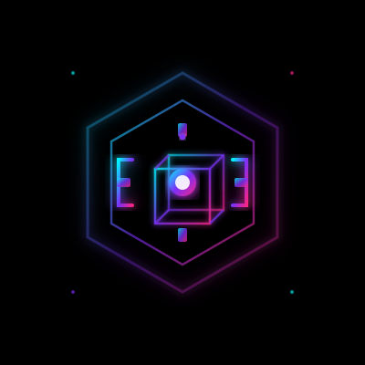

<p align="center">
  
</p>

<h1 align="center">
  
</h1>

<p align="center">
  <a href="https://github.com/GAuravgiy87">
    
  </a>
  <a href="mailto:gauravchauhan292005@gmail.com">
    
  </a>
  
</p>

<p align="center">
  
</p>

<p align="center">
  
</p>

<div align="center">

## 🚀 About Me


</div>

<table>
<tr>
<td width="50%">


</td>
<td width="50%">

### �‍💻 Who Am I?

```javascript
const gaurav = {
    role: "Full Stack Developer",
    specialties: ["Game Dev", "3D Artist", "AI/ML"],
    currentFocus: "Building innovative solutions",
    funFact: "I turn ☕ into <code/>",
    motto: "Code. Debug. Design. Repeat."
};
```

### 🎯 What I Do

🔹 **Web Development** - Crafting scalable applications  
🔹 **Game Development** - Creating immersive experiences  
🔹 **3D Modeling** - Designing stunning visuals  
🔹 **AI/ML** - Building intelligent solutions  

</td>
</tr>
</table>

<p align="center">
  
</p>


<div align="center">

## 🛠️ Tech Arsenal


</div>

### 💻 Programming Languages
<p align="center">
  
</p>

### 🎨 Frontend Development
<p align="center">
  
</p>

### ⚙️ Backend Development
<p align="center">
  
</p>

### 🗄️ Databases
<p align="center">
  
</p>

### ☁️ Cloud & DevOps
<p align="center">
  
</p>

### 🎮 Game Development
<p align="center">
  
</p>

### 🤖 AI/ML & Data Science
<p align="center">
  
</p>
<p align="center">
  
  
  
  
</p>

### 🛠️ Tools & Technologies
<p align="center">
  
</p>


## 📊 GitHub Analytics

<p align="center">
  
  
</p>

<p align="center">
  
  
</p>

<p align="center">
  
</p>

<p align="center">
  
</p>

<details>
  <summary><b>📈 More GitHub Metrics</b></summary>
  <br/>
  <p align="center">
    
  </p>
  <p align="center">
    
    
  </p>
  <p align="center">
    
    
  </p>
</details>


## 🎮 Game Development Showcase

<p align="center">
  
</p>

<table align="center">
  <tr>
    <td align="center" width="50%">
      <br/>
      <sub><b>Game Engine</b></sub>
    </td>
    <td align="center" width="50%">
      <br/>
      <sub><b>Indie Games</b></sub>
    </td>
  </tr>
</table>

### 🎨 3D Modeling & Design
<p align="center">
  
  
</p>


## 🤖 AI/ML Projects

<p align="center">
  
</p>

<p align="center">
  
  
  
  
</p>

<p align="center">
  
  
  
  
</p>


## 🌐 Connect With Me

<p align="center">
  
</p>

<div align="center">

[](https://github.com/GAuravgiy87)
[](mailto:gauravchauhan292005@gmail.com)
[](https://linkedin.com/in/gaurav-singh)
[](https://twitter.com/gauravsingh)
[](https://instagram.com/gauravsingh)

</div>

<p align="center">
  
  
</p>

<p align="center">
  
</p>

<p align="center">
  
</p>
